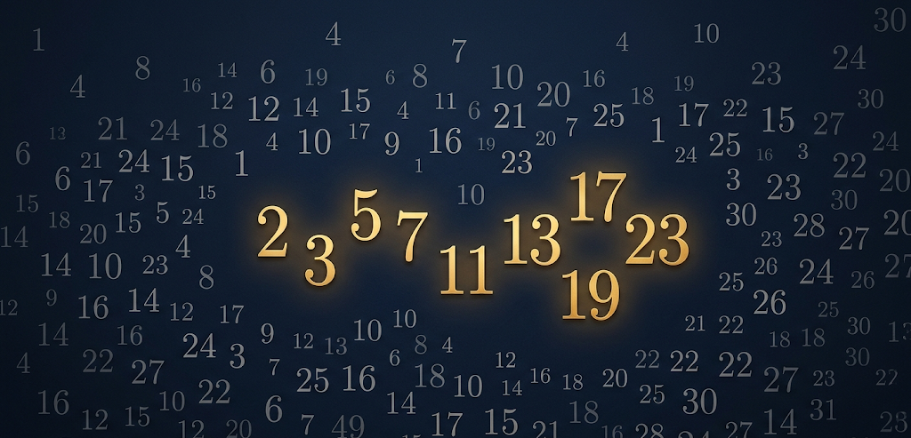
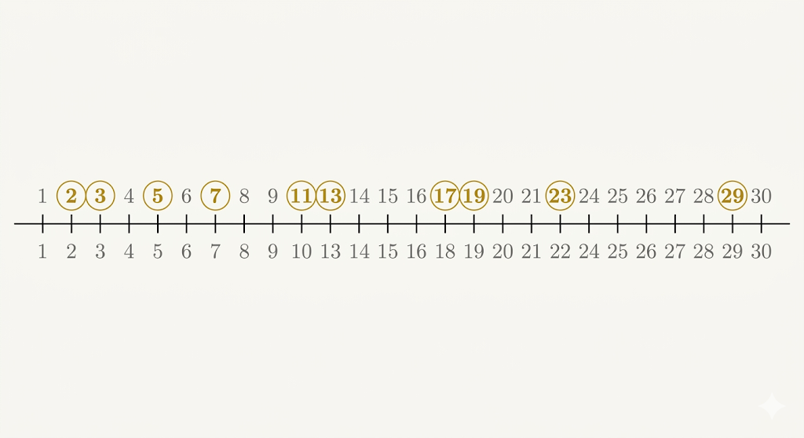
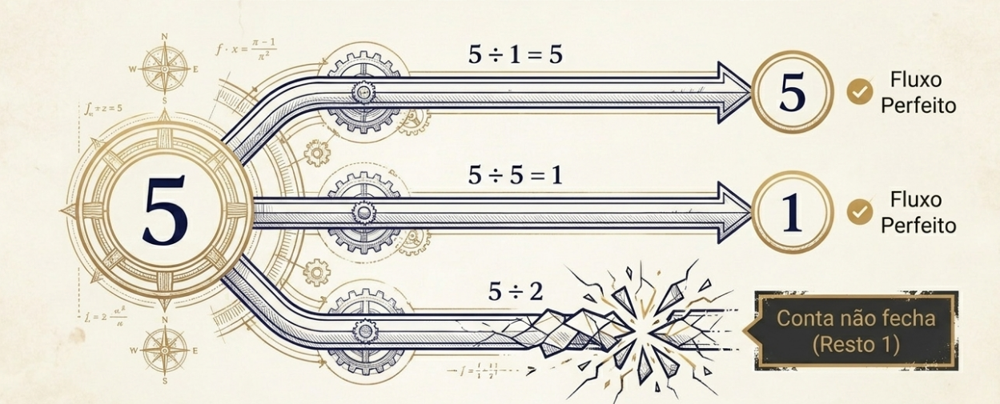
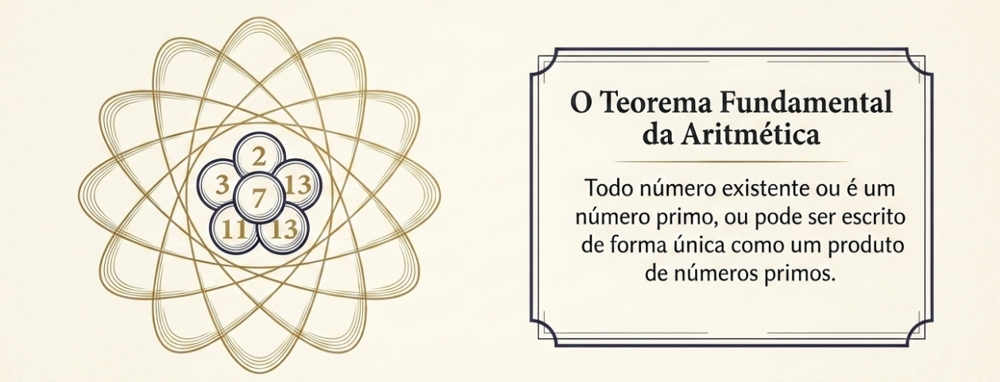
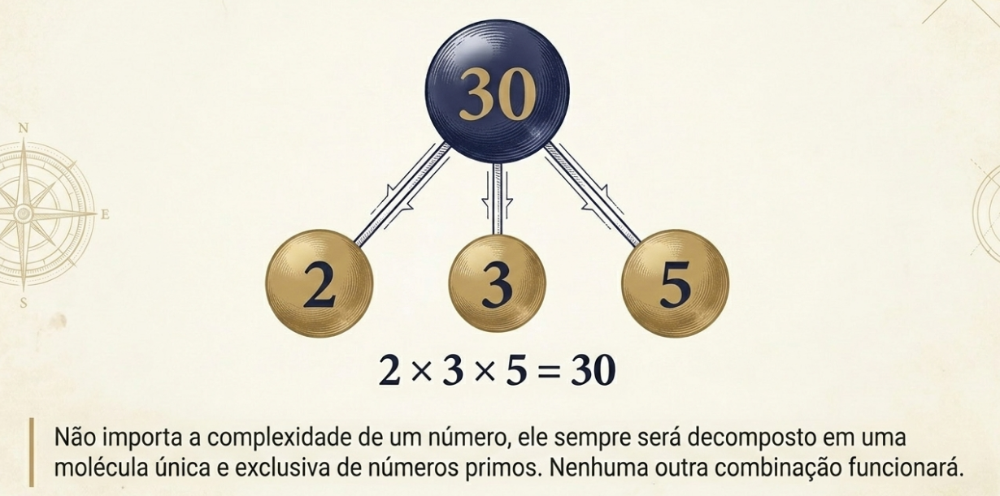
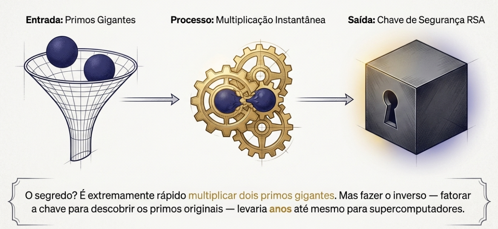
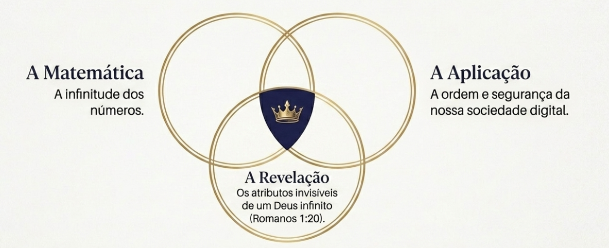

Você sabia que existe um conjunto de números que são **anti sociais**, não se misturam?

Isso não é uma característica muito boa para as pessoas, não é verdade? Existimos para sermos sociáveis, fomos criados para socializar com Deus e com os homens! Deus viu que o homem estava sozinho na criação, e com isso decidiu criar uma companheira pra ele. *Gênesis 2:18.*

Os nossos números anti sociais são os chamados **números primos**. Não sei se você os conhece ou lembra deles da época da escola!

{fig-align="center" width="100%"}

---

## O que são números primos?

Eles têm uma característica interessante. São números que são divisíveis **apenas por 1 e por eles mesmos**. Se tentarmos fazer a divisão com outros números, a conta não dá exata!

Os primeiros números primos são: **2, 3, 5, 7, 11, 13, 17, 19, 23, 29...**

{fig-align="center" width="100%"}

Por exemplo, o **5**:

- $5 \div 1 = 5$ ✅ Fluxo perfeito
- $5 \div 5 = 1$ ✅ Fluxo perfeito
- $5 \div 2 = 2$ com **resto 1** ❌ A conta não fecha!

{fig-align="center" width="100%"}

Ou seja, o 5 — assim como todos os primos — é anti social: não se divide com mais ninguém além do 1 e de si mesmo!

---

## Os átomos dos números

Os números primos são tão importantes e misteriosos que guardam um segredo ainda maior...

Foi descoberto e provado num teorema famoso que, de certa forma, **os números primos são os átomos dos números!**

{fig-align="center" width="100%"}

É o **Teorema Fundamental da Aritmética**. Ele diz basicamente que:

> *Todo número natural maior que 1 ou é primo, ou pode ser escrito de forma única (sem levar em conta a ordem) como produto de números primos.*

É como se os números primos fossem os **geradores** de todos os outros números! Veja alguns exemplos:

$$30 = 2 \times 3 \times 5$$

$$840 = 2 \times 2 \times 2 \times 3 \times 5 \times 7$$

$$77 = 7 \times 11$$

{fig-align="center" width="100%"}

Não importa a complexidade de um número — ele sempre será decomposto em uma "molécula" única e exclusiva de números primos. Nenhuma outra combinação funcionará.

---

## Os primos são infinitos

Mas quantos desses números anti sociais existem? Será que eles acabam em algum momento?

**Euclides**, o famoso matemático grego, provou que não. Os primos são **infinitos** — sempre haverá um novo primo além de qualquer lista que você faça. A prova que ele usou é engenhosa e elegante, digna de um artigo próprio!

E dois mil anos depois, esse mistério continua: os primos são infinitos, mas aparecem de forma **aparentemente aleatória**. Será que existe alguma ordem escondida nessa distribuição? Foi exatamente essa pergunta que intrigou **Bernhard Riemann** — ele queria encontrar uma fórmula precisa para contar quantos números primos existem abaixo de um determinado valor. Mas isso é tema para um próximo artigo!

---

## Primos protegem a internet

A história dos primos não termina na matemática pura. Na **criptografia**, o algoritmo **RSA** baseia-se na dificuldade de fatorar números inteiros grandes.

O RSA funciona assim: multiplicam-se dois primos enormes para criar uma chave de segurança. Quebrar essa chave exigiria fatorar o resultado — e isso levaria anos, mesmo com computadores potentes.

{fig-align="center" width="100%"}

Riemann estava pensando em matemática pura, sem imaginar que um dia seus estudos protegeriam transações bancárias pela internet! E essas propriedades dos números primos foram **descobertas** — ninguém criou. Bem... *Alguém* criou.

---

## O Criador criou

**Deus criou todos os números**, suas propriedades e, em particular, os números primos. Essas propriedades podem nos revelar um pouco de quem é Deus.

Além disso, Ele deixou essas propriedades para que pudéssemos usá-las e aplicar em várias outras áreas do conhecimento — inclusive em criptografia, para garantir a ordem e a segurança de nossa sociedade.

> *"A glória de Deus é ocultar certas coisas; tentar descobri-las é a glória dos reis."*  
> — Provérbios 25:2

Os números primos são **infinitos** — e nos remetem a um dos atributos invisíveis de Deus: um Deus infinito, eterno, que deixou os números, a natureza e a criação para que o conhecêssemos melhor.

> *"Porque os atributos invisíveis de Deus, assim o seu eterno poder, como também a sua própria divindade, claramente se reconhecem, desde a criação do mundo, sendo percebidos por meio das coisas que foram criadas."*  
> — Romanos 1:20

{fig-align="center" width="100%"}

